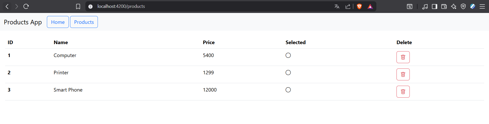

# 📦 Products App – Angular & Spring Boot
 


## 🎯 Objectif
L'objectif de cette activité pratique est de **comprendre et pratiquer les concepts de base d’Angular**, notamment :
- La création de composants et services.
- L’utilisation des directives structurelles (`*ngFor`, `*ngIf` ou `@for`, `@if` avec Angular 17).
- L’intégration avec une API REST (Spring Boot).
- La gestion des événements (suppression de produit).
- L’utilisation de Bootstrap pour le design.

---

## 🛠️ Technologies utilisées
- **Frontend :** Angular 17, Bootstrap 5, HttpClient
- **Backend :** Spring Boot (API REST)
- **Base de données :** H2 / MySQL (selon configuration)
- **Outils :** Node.js, npm, Maven

---

## ⚙️ Fonctionnalités
### Côté Frontend (Angular)
- Affichage de la liste des produits dans un tableau.
- Icône de validation si le produit est sélectionné.
- Suppression d’un produit avec confirmation (`confirm()`).
- Navigation simple avec un menu (Home, Products).
- Consommation de l’API Spring Boot via `HttpClient`.

### Côté Backend (Spring Boot)

Clone le backend à partir de :https://github.com/mohamedYoussfi/products-service.git

- API REST exposant :
    - `GET /products` → récupérer tous les produits.
    - `GET /products/{id}` → récupérer un produit par son identifiant.
    - `DELETE /products/{id}` → supprimer un produit.
- Utilisation de `ProductRepository` pour la persistance.

---

## 📂 Structure du projet
### Frontend (Angular)
    src/app/
    │
    ├── components/
    │ └── products/
    │ ├── products.ts
    │ ├── products.html
    │ └── products.css
    │
    ├── services/
    │ └── product.ts
    │
    └── app.component.html


### Backend (Spring Boot)
    src/main/java/com/example/demo/
    │
    ├── entities/
    │ └── Product.java
    │
    ├── repositories/
    │ └── ProductRepository.java
    │
    └── web/
    └── ProductRestAPI.java


---

## 🚀 Installation & exécution

### 1️⃣ Lancer le backend
```bash
    cd backend
    mvn spring-boot:run
```
L’API sera disponible sur :
👉 http://localhost:8083/products

2️⃣ Lancer le frontend
```bash
    cd frontend
    npm install
    ng serve
```
L’application Angular sera accessible sur :
👉 http://localhost:4200

## 📸 Aperçu
**Page Produits :** Liste des produits avec options de suppression.

**Navbar :** Navigation simple (Home, Products).

----
👨‍💻 **RABIH Hamza** - M1- II-BDCC- ENSET M
###  Réalisé dans le cadre d’une activité pratique Angular    .

